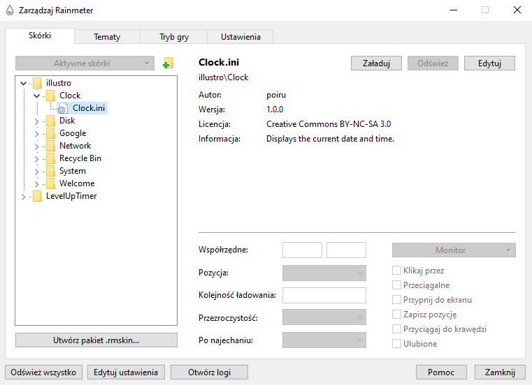
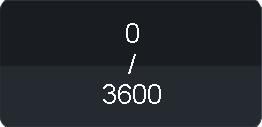

# Desktop-Timer-Windows
## Skin file
This is a Rainmeter skin.
Here is the most current version of the skin: [LevelUpTimer](LevelUpTimer.rmskin)
## Setup
To be able to use this project you have to install [Rainmeter](https://www.rainmeter.net).
After downloading and installing the Rainmeter software you will be met with some Boxes with data like: Welcome message, CPU/disk measure.
Click an icon of an arrow pointing up on the taskbar. Click the Rainmeter icon (droplet). The following window should pop up:

In the "illustro" folder click on each .ini file, and if loaded, unload them.\n
To install LevelUpTimer download the current version of the skin, then open it and proceed with the instructions given in the installation window.\n
After installing LevelUpTimer skin you will see a folder with the same name as the skin. You can simply load skin windows by loading .ini files from Level and Measure folders.
Level folder has a window with your current level.
Measure folder has a window with your current progress.

## How does the skin work
After loading both Level.ini and Measure.ini you will see 2 windows. You can drag them anywhere you like on your desktop.
To start measuring time you need to click on the measure window:

This will automatically start the timer (in seconds).After reaching the goal timer will nullify itself, goal will rise, and the level will rise by 1.

The level will be displayed on the level window. Every 5 levels the background color of level window will change going from green to red. The "highest" level's color is on 100 level milestone although you can go for higher levels.

## Modifying 
You can freely customize this software. In code you will find helpful hints what to do and why.

If you would like to publish your own modification of my software, you are free to do it only if you provide credits to my work.

## Why to use it
You can use this software as a motivation system. It is based on game phylosoffical aspect - grinding. When you have a goal to reach it is easier to motivate yourself. 
Before a learning session you can click the timer and start studying. In theory you should be more engaged and more willing to spend more time and more frequently.
By the time you reach 100 level you will spend so much time on the thing you are working on that for sure you will see results!

## License
This project is licensed under the MIT License – see the [LICENSE](LICENSE) file for details.